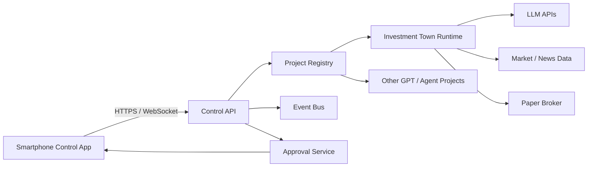

# Investment Town

**Mobile-first AI Project Control Center + Multi-Agent Investment Research Town**

Investment Town is designed as two layers:

1. **AI Control Center** — a smartphone control plane for monitoring and operating multiple GPT/Agent projects.
2. **Investment Town** — the first domain project: a multi-agent investment research and paper-trading environment where specialist agents collaborate like a virtual investment firm.

> Default operating mode: **Paper Trading only**. Live-broker execution is intentionally gated behind additional security, risk controls, and explicit human approval.

## Core idea

The smartphone is **not** the main compute node. It is the command-and-observability console. Agent runtimes, market-data jobs, databases, schedulers, model API calls, and broker adapters run on backend infrastructure.



## Documentation

- [Product & UX Storyboard](docs/STORYBOARD.md)

## Repository structure

```text
investment-town/
├─ apps/
│  ├─ town-web/               # TypeScript + React + Phaser
│  └─ mobile/                 # TypeScript + React Native + Expo
├─ backend/                   # Python + FastAPI + LangGraph
│  ├─ src/investment_town/
│  └─ pyproject.toml
├─ shared/
│  └─ schemas/                # Event / command contracts
├─ infra/                     # Docker / PostgreSQL / Redis
├─ docs/
│  └─ STORYBOARD.md
├─ .env.example
├─ .gitignore                 # Python template + frontend additions
├─ project.manifest.example.yaml
└─ README.md
```

### Technology split

- **Town visualization:** TypeScript + React + Phaser
- **Mobile control center:** TypeScript + React Native + Expo
- **Agent / investment runtime:** Python + FastAPI + LangGraph
- **Persistence:** PostgreSQL + pgvector
- **Realtime state / queue:** Redis
- **LLM strategy:** Cloud API first, optional local model workers later
- **Communication:** REST for commands and WebSocket for live events

The Town and mobile applications are clients. The Python backend remains the source of truth and continues running even when no frontend is open.

## Backend quick start

```bash
cd backend
python -m venv .venv
# activate .venv
pip install -e .[dev]
uvicorn investment_town.main:app --reload
```

Then open `http://127.0.0.1:8000/docs`. The current runtime is intentionally **paper-trading only**.

## Recommended first milestone

Build the Control Center and Investment Town in **observation + paper trading mode** before any live-order integration.

