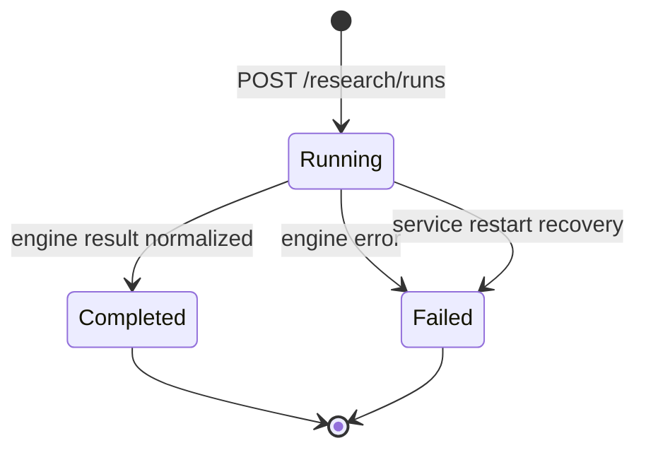

# MVP 2A Research Runtime

MVP 2A turns one opaque Agent analysis request into a durable research run that can be
inspected after completion, failure, or service restart.

## Run lifecycle

A run may start only while the `investment-town` project is running. The HTTP request
returns `202 Accepted` with the durable run ID, and the analysis continues as a FastAPI
background task in the single-process MVP runtime.

## Agent stages

| Stage | Agent tasks |
|---|---|
| 1 | News, Fundamental, Macro, Quant |
| 2 | Bull, Bear |
| 3 | Risk |
| 4 | Portfolio Manager |

TradingAgents state is normalized into these Investment Town roles. A non-empty upstream
result completes the task and creates a Blackboard entry. If the configured engine does not
return a corresponding structured result, the task is marked `skipped`; Investment Town
does not invent a summary.

## Durable data

- `research_runs`: lifecycle, ticker, date, final rating, linked proposal, safe error;
- `research_agent_tasks`: stage, Agent status, compact summary, timestamps;
- `blackboard_entries`: full Agent output and source metadata;
- `research_proposals`: final human-gated proposal created only after successful completion;
- `events`: run and Agent transitions for the WebSocket timeline.

All completion records, the final proposal, and Blackboard entries are committed in one
SQLite transaction. Failed runs do not create proposals. Unexpected provider errors are
stored as a generic message so provider secrets are not copied into durable state.

Project `pause`, `stop`, or `kill` commands fail every active research run. An upstream
call already executing in a worker thread may finish internally, but its late result is
discarded and cannot create a proposal or Paper order.

## Safety boundary

Research completion creates a `pending` proposal only. It never creates a Paper order or
contacts a live broker. The MVP 1.2B human approval gate remains the only path from an Agent
proposal to the local Paper broker.

## Deployment boundary

Background tasks and the in-process event hub require one API process. Before multiple
instances or long-running production jobs, move execution to a durable queue/worker, use
PostgreSQL transactions, publish events through Redis Streams, and add retry/checkpoint
policies. Restart recovery currently marks interrupted runs failed; it does not resume the
upstream graph.
