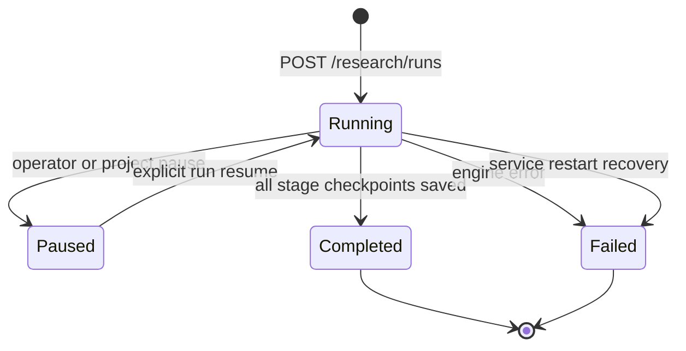

# MVP 2B Checkpointed Research Runtime

MVP 2B turns one opaque Agent analysis request into a checkpointed research run that can be
paused between materialization stages, resumed without a second provider call, retried after
failure, and inspected after completion or service restart.

## Run lifecycle

A run may start, resume, or retry only while the `investment-town` project is running. The HTTP request
returns `202 Accepted` with the durable run ID, and the analysis continues as a FastAPI
background task in the single-process MVP runtime.

## Agent stages

| Stage | Agent tasks |
|---|---|
| 1 | News, Fundamental, Macro, Quant |
| 2 | Bull, Bear |
| 3 | Risk |
| 4 | Portfolio Manager |

TradingAgents state is normalized once into these Investment Town roles and stored as a
private durable snapshot. Each stage then materializes independently. A non-empty upstream
result completes the task and creates a Blackboard entry. If the configured engine does not
return a corresponding structured result, the task is marked `skipped`; Investment Town
does not invent a summary.

Every completed stage writes a checkpoint. Pause writes a paused checkpoint, and resume
continues at `current_stage` from the stored snapshot. Retry increments the attempt counter,
keeps already completed stages, and resets only failed tasks.

## Durable data

- `research_runs`: lifecycle, ticker, date, final rating, linked proposal, safe error;
- `research_agent_tasks`: stage, Agent status, compact summary, timestamps;
- `research_checkpoints`: completed or paused stage snapshots;
- `blackboard_entries`: full Agent output and source metadata;
- `model_usage`: provider-reported model, prompt/completion tokens, and estimated cost;
- `research_analysis_snapshots`: normalized private result used until terminal completion;
- `research_proposals`: final human-gated proposal created only after successful completion;
- `events`: run and Agent transitions for the WebSocket timeline.

Each stage, its Blackboard entries, usage records, and checkpoint are committed in one
SQLite transaction. The final stage also commits the proposal and aggregate usage. Failed
runs do not create proposals. Unexpected provider errors are
stored as a generic message so provider secrets are not copied into durable state.

Project `pause` checkpoints every active research run. Project `stop` or `kill` fails active
runs. An upstream call already executing in a worker thread may finish internally, but a
stopped or killed run discards the late result and cannot create a proposal or Paper order.

## Safety boundary

Research completion creates a `pending` proposal only. It never creates a Paper order or
contacts a live broker. The MVP 1.2B human approval gate remains the only path from an Agent
proposal to the local Paper broker.

## Deployment boundary

Background tasks, in-process coordination, and the event hub require one API process. Before multiple
instances or long-running production jobs, move execution to a durable queue/worker, use
PostgreSQL transactions, publish events through Redis Streams, and add retry/checkpoint
policies. Restart recovery currently marks interrupted runs failed; it does not resume the
upstream graph.
