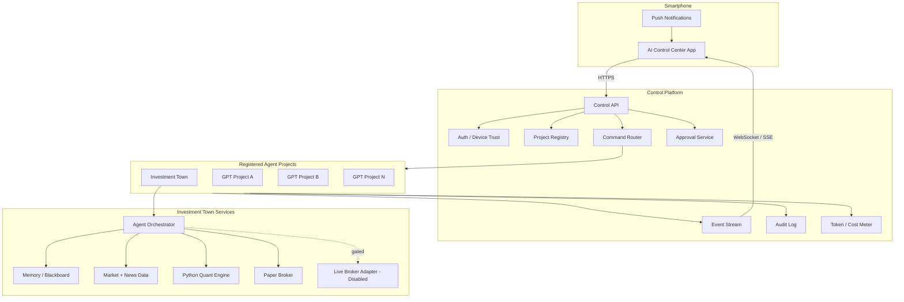
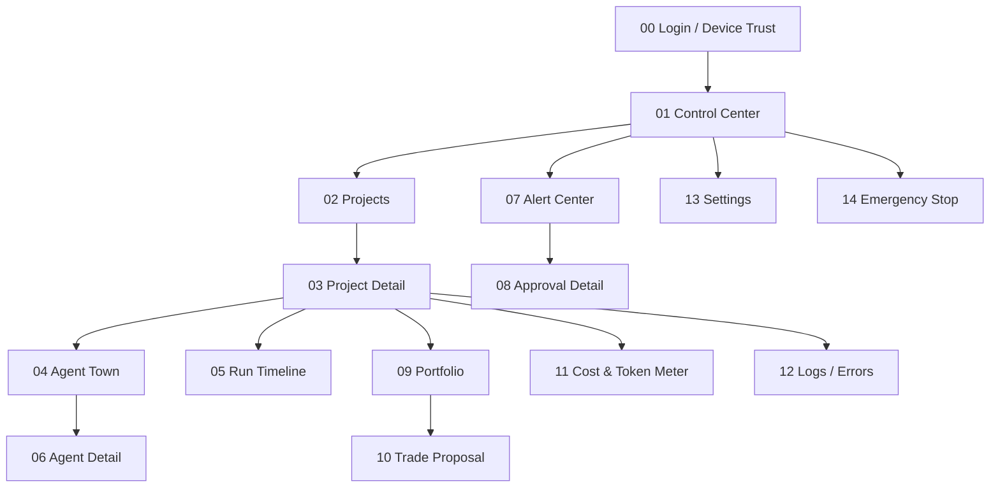
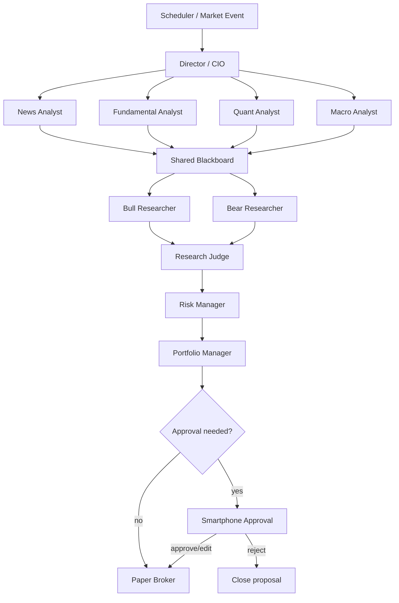
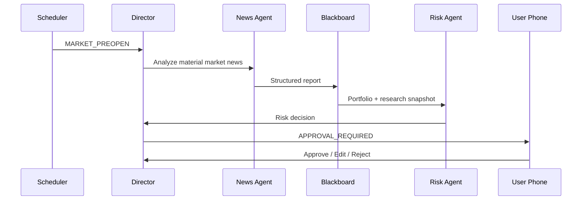
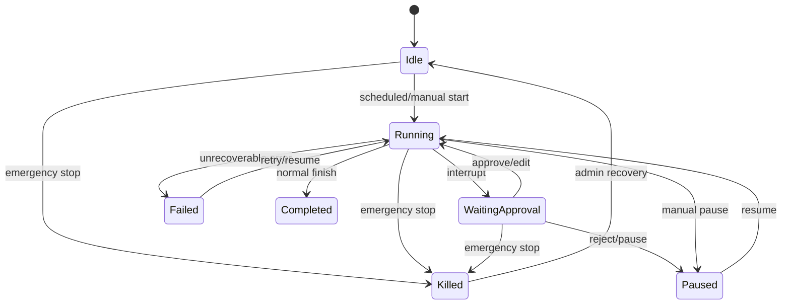
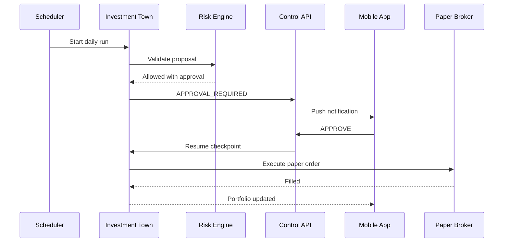

# Investment Town — Mobile AI Control Center Storyboard

**Document type:** Product / UX / System Storyboard  
**Version:** 0.1  
**Status:** Initial development blueprint  
**Primary device:** Smartphone  
**Primary runtime:** Cloud/server backend; phone is the control plane  

---

## 1. Product vision

### 1.1 One-line concept

> **A smartphone control center that monitors every GPT/Agent project, with Investment Town as the first flagship project: a persistent multi-agent investment research company that can analyze markets, debate decisions, simulate trades, and ask for human approval when a sensitive action is proposed.**

### 1.2 Why smartphone-first

The user should not need to sit at a desktop to know whether an agent workflow is healthy, what it is doing, how much it costs, whether a task failed, or whether a high-impact action is waiting for approval.

The phone handles:

- project health monitoring;
- run / pause / resume commands;
- agent activity visualization;
- alerts and failures;
- approval / rejection;
- logs and execution timeline;
- token and API-cost monitoring;
- portfolio and paper-trade status;
- emergency stop.

The phone does **not** need to run the LLM locally. Heavy computation remains on backend infrastructure.

---

## 2. Product boundary

### 2.1 Platform layer: AI Control Center

The Control Center is intentionally broader than Investment Town.

Any GPT/Agent project can register itself using a standard project manifest and a small runtime adapter.

Examples:

- Investment Town;
- personal research agent;
- document processing agent;
- coding agent;
- news monitoring agent;
- home automation agent;
- scheduling / assistant agent.

### 2.2 Domain layer: Investment Town

Investment Town is the first complete project registered in the platform.

It behaves like a small investment company:

- Director / CIO;
- News Analyst;
- Fundamental Analyst;
- Quant / Technical Analyst;
- Macro Analyst;
- Bull Researcher;
- Bear Researcher;
- Risk Manager;
- Portfolio Manager;
- Paper Broker.

Each role has separate instructions, tools, memory, permissions, and output schema even if several roles use the same underlying cloud LLM.

---

## 3. Design principles

1. **Phone = Control Plane, not Compute Plane**  
   The smartphone controls remote runtimes rather than hosting large LLMs.

2. **Every important action becomes an event**  
   Agent started, tool called, report completed, risk rejected, approval requested, order simulated, and failure recovered are all represented as structured events.

3. **Structured internal communication**  
   Agents may write natural-language analysis, but inter-agent and app communication uses typed JSON/event schemas.

4. **Human-in-the-loop for irreversible actions**  
   A workflow can pause, persist state, wait for approval, and resume afterward. This is a native pattern in modern agent orchestration runtimes such as LangGraph and the OpenAI Agents SDK.

5. **Deterministic calculations outside the LLM**  
   Indicators, portfolio math, limits, P&L, exposure, and backtests are calculated by deterministic code. The LLM interprets the results.

6. **Paper trading first**  
   The first production-like version never sends a live brokerage order.

7. **Full auditability**  
   Important prompts, model versions, tool calls, state transitions, decisions, approvals, and simulated orders are recorded.

---

## 4. High-level system architecture



---

## 5. General GPT Project Control Protocol

To monitor arbitrary GPT/Agent projects, every project exposes the same minimal control contract.

### 5.1 Project manifest

```yaml
id: investment-town
name: Investment Town
version: 0.1.0
runtime: langgraph
mode: paper-trading

capabilities:
  - health
  - status
  - start
  - pause
  - resume
  - stop
  - kill
  - events
  - approvals
  - metrics
  - logs

risk_level: high
approval_policy: human-required-for-execution
```

### 5.2 Minimal project state

```json
{
  "project_id": "investment-town",
  "status": "running",
  "health": "healthy",
  "current_run_id": "run_20260812_001",
  "active_agents": 4,
  "pending_approvals": 1,
  "errors_24h": 0,
  "token_cost_today": 3.82,
  "last_event_at": "2026-08-12T13:58:22+09:00"
}
```

### 5.3 Command envelope

```json
{
  "command_id": "cmd_01",
  "project_id": "investment-town",
  "type": "PAUSE_RUN",
  "requested_by": "mobile-user",
  "requested_at": "2026-08-12T14:00:00+09:00",
  "reason": "manual intervention"
}
```

### 5.4 Event envelope

```json
{
  "event_id": "evt_9281",
  "project_id": "investment-town",
  "run_id": "run_20260812_001",
  "source": "risk-manager",
  "type": "APPROVAL_REQUIRED",
  "severity": "high",
  "timestamp": "2026-08-12T14:01:32+09:00",
  "payload": {
    "action": "paper_order",
    "ticker": "NVDA",
    "side": "BUY",
    "risk_score": 0.71
  }
}
```

---

# 6. Smartphone information architecture



---

# 7. Screen storyboard

## S00 — Login / Trusted Device

### User goal

Open the control app securely without exposing API or brokerage secrets on the device.

### UI

```text
┌────────────────────────────┐
│        AI CONTROL          │
│                            │
│     Investment Town       │
│                            │
│      [ Face / Finger ]     │
│                            │
│   Trusted device required  │
└────────────────────────────┘
```

### Behavior

- biometric/device authentication;
- short-lived access token;
- server-side secret storage;
- mobile app never displays full brokerage/API credentials;
- new-device sign-in creates a security event.

### Success transition

`S00 → S01`

---

## S01 — Global Control Center

### User goal

Understand the health of every AI project in under 5 seconds.

### UI

```text
┌────────────────────────────┐
│ AI CONTROL CENTER      ●   │
├────────────────────────────┤
│ Projects                    │
│                            │
│ 🏙 Investment Town         │
│ RUNNING   7 agents         │
│ 1 approval                 │
│                            │
│ 📚 Research Agent          │
│ IDLE                       │
│                            │
│ 💻 Coding Agent            │
│ FAILED          !          │
│                            │
├────────────────────────────┤
│ Home  Projects Alerts More │
└────────────────────────────┘
```

### Primary data

- project health;
- current runtime state;
- active agents/workers;
- pending approvals;
- current error count;
- cost today;
- last heartbeat.

### Actions

- tap a project;
- filter Running / Failed / Waiting Approval;
- global emergency stop;
- open alerts.

---

## S02 — Project List / Registry

### User goal

View all registered GPT projects and add/manage adapters.

### Card states

- `RUNNING`
- `IDLE`
- `PAUSED`
- `WAITING_APPROVAL`
- `FAILED`
- `OFFLINE`

### Future extension

A project can be local, cloud-hosted, or third-party as long as its gateway publishes the standard status/events contract.

---

## S03 — Investment Town Project Detail

### User goal

See the complete state of the investment agent system.

### UI

```text
┌────────────────────────────┐
│ ‹ Investment Town          │
├────────────────────────────┤
│ HEALTHY            RUNNING │
│                            │
│ Market: OPEN               │
│ Active Agents: 5 / 9       │
│ Pending Approval: 1        │
│ Paper P&L: +1.24%          │
│ Cost Today: $2.81          │
│                            │
│ [ Enter Agent Town ]       │
│ [ Execution Timeline ]     │
│ [ Portfolio ]              │
│                            │
│ Pause       Stop           │
└────────────────────────────┘
```

### Important rule

`Stop` ends the current run gracefully.  
`Emergency Stop` cancels dispatch of any new external action and disables broker adapters.

---

## S04 — Agent Town

### User goal

Watch the multi-agent company working in a Sims-like spatial representation.

### Visual model

```text
┌─────────────────────────────────┐
│ INVESTMENT TOWN       09:41 EST │
│                                 │
│ ┌ News Desk ┐   ┌ Quant Lab ┐   │
│ │ 📰 NEWS   │   │ 📈 QUANT  │   │
│ │ reading.. │   │ done ✓    │   │
│ └───────────┘   └───────────┘   │
│                                 │
│       ┌ Meeting Room ┐          │
│       │ 🐂 BULL      │          │
│       │ 🐻 BEAR      │          │
│       │ debating...  │          │
│       └──────────────┘          │
│                                 │
│ ┌ Risk ┐          ┌ CIO ┐       │
│ │ ⚠️   │          │ 👔  │       │
│ └──────┘          └─────┘       │
└─────────────────────────────────┘
```

### Agent animation state mapping

| Runtime event | Town visualization |
|---|---|
| `AGENT_IDLE` | seated / neutral |
| `TASK_ASSIGNED` | moves to workstation |
| `TOOL_CALL` | workstation activity |
| `REPORT_READY` | document icon appears |
| `MEETING_STARTED` | agents move to meeting room |
| `DEBATE_STARTED` | Bull/Bear discussion animation |
| `APPROVAL_REQUIRED` | CIO desk flashes |
| `ERROR` | red warning state |

### Design requirement

The animation never determines business logic. It only reflects backend state.

---

## S05 — Run Timeline

### User goal

Understand exactly how the latest result was produced.

```text
09:30  Run started
09:31  News Analyst → 126 articles fetched
09:32  Filter → 18 material articles
09:33  Fundamental Analyst started
09:34  Quant engine completed
09:36  Bull thesis completed
09:37  Bear thesis completed
09:38  Risk Manager → concentration warning
09:40  Portfolio Manager → proposal created
09:41  WAITING FOR APPROVAL
```

### Tap behavior

Every timeline entry opens:

- input summary;
- tool calls;
- structured output;
- model/provider;
- token usage;
- execution duration;
- links to source data;
- error/retry history.

---

## S06 — Agent Detail

### User goal

Inspect one agent without reading the entire system log.

### Example

```text
RISK MANAGER
Status: Waiting
Model: reasoning-cloud
Run: #20260812-001

Current assessment
Risk Score             0.71
Portfolio concentration HIGH
Volatility              MED
Liquidity               OK

Latest decision
"Reduce proposed order size"

[Memory] [Tools] [History]
```

### Debug fields

- role/instructions version;
- tool permission list;
- model routing policy;
- last 20 tasks;
- success/failure rate;
- token use;
- response latency.

---

## S07 — Alert Center

### User goal

See only events that may need attention.

### Priority classes

**Critical**

- emergency stop triggered;
- brokerage connection mismatch;
- authentication/security event;
- risk limit violation.

**High**

- approval required;
- important data source unavailable;
- model repeatedly fails;
- project offline.

**Normal**

- scheduled analysis complete;
- daily report ready;
- paper trade executed.

### Push policy

Only meaningful events generate mobile push notifications. Routine agent messages remain in the event timeline.

---

## S08 — Approval Detail

### User goal

Make a high-impact decision from the phone with enough context to understand what is being approved.

```text
┌────────────────────────────┐
│ APPROVAL REQUIRED          │
│                            │
│ Project: Investment Town   │
│ Proposal: BUY NVDA         │
│ Mode: PAPER                │
│                            │
│ Bull Score        0.78     │
│ Bear Score        0.53     │
│ Risk Score        0.71     │
│                            │
│ Reason                     │
│ AI demand remains strong…  │
│                            │
│ [ Full Evidence ]          │
│                            │
│ [Reject] [Edit] [Approve]  │
└────────────────────────────┘
```

### Approval rules

For paper trading, approval can become optional after testing.

For any future live execution:

- explicit approval policy;
- order-size ceiling;
- per-symbol exposure ceiling;
- daily drawdown ceiling;
- symbol allowlist;
- stale-price protection;
- duplicate-order protection;
- audit record;
- server-side kill switch.

No LLM is permitted to bypass these deterministic controls.

---

## S09 — Portfolio

### User goal

See portfolio state without entering the broker app.

### Sections

- total paper NAV;
- cash;
- daily / weekly / total P&L;
- positions;
- concentration;
- benchmark comparison;
- realized/unrealized P&L;
- open proposals;
- risk budget.

### Important distinction

The source of truth is the brokerage/paper-broker ledger, not the LLM's memory.

---

## S10 — Trade Proposal

### User goal

Inspect the entire rationale behind one proposed action.

### Information hierarchy

1. Proposed action;
2. deterministic portfolio checks;
3. market snapshot;
4. Bull thesis;
5. Bear thesis;
6. Risk Manager conclusion;
7. CIO/Portfolio Manager conclusion;
8. source evidence;
9. model confidence/uncertainty metadata;
10. previous similar decisions.

### Example decision payload

```json
{
  "proposal_id": "p_1041",
  "ticker": "NVDA",
  "action": "BUY",
  "mode": "PAPER",
  "requested_weight_delta": 0.02,
  "max_allowed_weight_delta": 0.025,
  "risk": {
    "score": 0.71,
    "decision": "ALLOW_WITH_REDUCED_SIZE"
  },
  "approval": "REQUIRED"
}
```

---

## S11 — Cost & Token Meter

### User goal

Prevent multi-agent workflows from silently consuming excessive API tokens.

### UI metrics

- daily model spend;
- monthly model spend;
- spend by project;
- spend by agent;
- input/output token counts;
- data API spend;
- average cost per analysis run;
- budget remaining.

### Controls

- daily budget cap;
- monthly project cap;
- cheaper-model fallback;
- disable nonessential debate rounds;
- disable low-priority scheduled jobs.

### Model routing principle

```text
Deterministic math        → Python
Classification/extraction → inexpensive model
Research synthesis        → medium model
Critical reasoning        → strong reasoning model
Order/risk rules           → deterministic server rules
```

---

## S12 — Logs / Errors

### User goal

Debug from the phone when away from a computer.

### Error card

```text
FAILED — News Analyst
13:42:21

Provider timeout
Retry 2 / 3
Fallback provider available

[Retry Now]
[Pause Agent]
[Open Trace]
```

### Mobile scope

The phone can trigger high-level recovery actions but should not expose an unrestricted production shell.

---

## S13 — Settings / Integrations

### Project settings

- enable/disable project;
- schedules;
- model routing profile;
- token budget;
- notification rules;
- data-provider status;
- broker adapter status;
- paper/live mode indicator.

### Secret-handling rule

The app shows only:

`CONNECTED / EXPIRED / ERROR / REAUTH REQUIRED`

It does not reveal raw API secrets after registration.

---

## S14 — Emergency Stop

### User goal

Immediately stop risky outward actions without needing a laptop.

```text
┌────────────────────────────┐
│       EMERGENCY STOP       │
│                            │
│ This will:                 │
│ • stop new agent actions   │
│ • stop broker dispatch     │
│ • pause scheduled runs     │
│ • preserve audit logs      │
│                            │
│ Hold to confirm            │
│ ███████████████░░░         │
└────────────────────────────┘
```

### Server behavior

1. revoke execution capability;
2. disable external-action tool routes;
3. pause schedules;
4. preserve current state/checkpoint;
5. emit `GLOBAL_KILL_SWITCH` event;
6. require explicit administrative resume.

---

# 8. Investment Town agent topology



---

# 9. Agent responsibilities

| Agent | Primary job | LLM need | Key tools |
|---|---|---|---|
| Director | task decomposition / routing | medium-strong | project state, scheduler |
| News Analyst | event discovery / filtering | cheap-medium | news/search APIs |
| Fundamental | financial interpretation | medium-strong | filings, financial DB |
| Quant | technical / factor calculations | low LLM dependency | Python/dataframes |
| Macro | rates / FX / macro interpretation | medium | macro datasets |
| Bull | strongest buy thesis | strong | blackboard |
| Bear | strongest counter-thesis | strong | blackboard |
| Risk Manager | challenge proposal | strong + deterministic rules | exposure, volatility, limits |
| Portfolio Manager | final proposal | strong | all summaries + risk output |
| Paper Broker | ledger/execution | no LLM | deterministic order engine |

---

# 10. Agent communication model

Agents are not continuously conscious processes.

Each agent wakes because an event, scheduler, message, or previous agent output creates the next input.



Internal messages should be compact structured objects rather than unrestricted full-chat-history forwarding.

---

# 11. Shared Blackboard

The Blackboard is the canonical shared research state for a run.

```json
{
  "ticker": "NVDA",
  "run_id": "run_20260812_001",
  "research": {
    "news": {
      "score": 0.72,
      "summary": "...",
      "evidence_ids": ["news_31", "news_55"]
    },
    "fundamental": {
      "score": 0.81,
      "summary": "..."
    },
    "quant": {
      "momentum_20d": 0.143,
      "rsi_14": 72.4,
      "volatility_20d": 0.31
    }
  }
}
```

Benefits:

- less duplicated context;
- lower token cost;
- easier replay/debugging;
- clear source attribution;
- individual agents only read what they need.

---

# 12. Runtime states



Persistent checkpoints allow a run to pause for human input and continue later rather than restarting the entire analysis.

---

# 13. Notification storyboard

## Event: approval required

**Push**

> Investment Town: NVDA paper-trade proposal is waiting for approval.

Tap → `S08 Approval Detail`

## Event: failed project

> Coding Agent is offline after 3 retries.

Tap → `S12 Logs / Errors`

## Event: risk breach

> Investment Town paused: portfolio concentration limit was exceeded.

Tap → `S03 Investment Town Detail`

## Event: daily report

> Investment Town finished the daily paper-trading report.

Tap → `S05 Run Timeline`

---

# 14. Security model

## 14.1 Rules

- phone never owns unrestricted backend credentials;
- broker keys are server-side only;
- runtime command endpoints require authenticated authorization;
- dangerous commands require recent user authentication;
- all commands carry actor, timestamp, project, and request ID;
- replay protection for sensitive commands;
- project-specific permissions;
- immutable audit trail for high-impact events.

## 14.2 Roles

### Viewer

Can read status, events, metrics.

### Operator

Can start, pause, resume, retry.

### Approver

Can approve/edit/reject gated actions.

### Administrator

Can configure integrations, live-mode policy, trusted devices, and recovery after kill-switch activation.

---

# 15. Investment risk and execution safeguards

Investment Town should distinguish **analysis automation** from **capital execution**.

## Phase A — Research only

- no broker integration;
- generates reports and proposals.

## Phase B — Paper Trading

- simulated cash and positions;
- deterministic order ledger;
- realistic fees/slippage assumptions;
- benchmark comparison;
- decision replay.

## Phase C — Shadow Live

- receives real prices/account state;
- creates orders but never transmits them;
- compare proposed vs actual outcomes.

## Phase D — Human-approved Live

Only after explicit implementation of:

- broker adapter;
- device/session security;
- risk engine;
- order limits;
- duplicate protection;
- stale data checks;
- market-hours policy;
- auditability;
- emergency stop;
- human approval.

## Phase E — Limited automation

Only deterministic low-risk policies may become auto-approved. The risk engine—not the LLM—decides whether a proposal is eligible for automatic execution.

---

# 16. MVP development storyboard

## MVP 0 — Clickable control prototype

**Goal:** validate smartphone information architecture.

Deliverables:

- static Expo/React Native screens;
- project cards;
- Investment Town map mock;
- timeline mock;
- approval card;
- kill-switch interaction.

No backend and no LLM yet.

---

## MVP 1 — Generic AI Control Center

**Goal:** monitor one or more dummy projects.

Backend:

- authentication;
- project registry;
- `/health`;
- `/status`;
- `/commands`;
- event streaming;
- audit log.

Mobile:

- S01–S03;
- S07;
- S12;
- push notifications.

---

## MVP 2 — Investment Town Research Runtime

**Goal:** multi-agent analysis without trade execution.

Agents:

- Director;
- News;
- Fundamental;
- Quant;
- Bull;
- Bear;
- Risk;
- Portfolio Manager.

System:

- shared Blackboard;
- structured outputs;
- run checkpoints;
- event stream;
- model cost logging;
- full execution timeline.

---

## MVP 3 — Paper Trading

**Goal:** test investment workflow over weeks/months.

Add:

- paper broker;
- simulated cash/positions;
- order proposal ledger;
- portfolio screen;
- performance reports;
- benchmark;
- risk limits;
- mobile approvals.

Success criteria:

- complete decision lineage for every simulated order;
- reproducible portfolio ledger;
- no order can bypass deterministic risk validation.

---

## MVP 4 — Multi-project platform

**Goal:** make smartphone control generic.

Add project adapters for two unrelated agent systems.

Validate that the same mobile UI can:

- monitor health;
- open logs;
- start/pause/resume;
- receive alerts;
- display token costs;
- process project-specific approvals.

---

## MVP 5 — Production hardening

- persistent DB;
- event retention policy;
- observability;
- encrypted secret service;
- permissions;
- rate limiting;
- load tests;
- backup/recovery;
- provider fallback;
- incident runbook;
- security review.

---

# 17. Suggested technical stack

## Mobile

**Expo + React Native + Expo Router**

Reasons:

- one application structure for Android, iOS, and web;
- file-based navigation;
- deep-linkable approval/error pages;
- push-notification support through `expo-notifications`.

## Control backend

- Python 3.12+
- FastAPI
- WebSocket or Server-Sent Events
- PostgreSQL
- Redis Streams or equivalent event queue

## Investment Town runtime

**LangGraph** is a strong initial fit because long-running stateful workflows, checkpoint persistence, streaming, and human-in-the-loop interrupts directly map to the approval/resume storyboard.

A future adapter may also support the **OpenAI Agents SDK**, whose current primitives include agents, tools, handoffs/agents-as-tools, guardrails, sessions, human-in-the-loop, and tracing.

## Agent model layer

Provider-independent routing layer:

```text
cheap_classifier
research_model
reasoning_model
fallback_model
```

Avoid hard-coding every agent to a single provider.

## Market calculations

- pandas / polars;
- NumPy;
- deterministic risk/portfolio engine;
- isolated backtest service.

## Observability

- structured JSON logs;
- traces;
- model/token metrics;
- event timeline;
- alert routing.

---

# 18. Proposed repository layout

```text
investment-town/
├─ apps/
│  └─ mobile/
│     ├─ app/
│     │  ├─ index.tsx
│     │  ├─ projects/
│     │  ├─ alerts/
│     │  ├─ approvals/
│     │  └─ settings/
│     └─ components/
│
├─ services/
│  ├─ control-api/
│  │  ├─ api/
│  │  ├─ auth/
│  │  ├─ registry/
│  │  ├─ events/
│  │  └─ approvals/
│  │
│  ├─ investment-town/
│  │  ├─ agents/
│  │  ├─ graph/
│  │  ├─ tools/
│  │  ├─ risk/
│  │  ├─ portfolio/
│  │  └─ broker/
│  │
│  └─ project-gateway/
│
├─ packages/
│  ├─ project-sdk/
│  ├─ event-schema/
│  └─ ui-types/
│
├─ docs/
│  ├─ STORYBOARD.md
│  ├─ ARCHITECTURE.md
│  ├─ API.md
│  └─ SECURITY.md
│
├─ infra/
├─ tests/
├─ project.manifest.example.yaml
└─ README.md
```

---

# 19. Initial API sketch

```text
GET    /v1/projects
GET    /v1/projects/{id}
GET    /v1/projects/{id}/runs
GET    /v1/projects/{id}/runs/{run_id}
POST   /v1/projects/{id}/commands/start
POST   /v1/projects/{id}/commands/pause
POST   /v1/projects/{id}/commands/resume
POST   /v1/projects/{id}/commands/stop
POST   /v1/projects/{id}/commands/kill
GET    /v1/projects/{id}/events
GET    /v1/projects/{id}/metrics
GET    /v1/approvals
GET    /v1/approvals/{approval_id}
POST   /v1/approvals/{approval_id}/approve
POST   /v1/approvals/{approval_id}/edit
POST   /v1/approvals/{approval_id}/reject
WS     /v1/events/stream
```

---

# 20. Core database entities

```text
User
Device
Project
ProjectRuntime
Agent
Run
RunCheckpoint
Event
ToolCall
AgentMessage
BlackboardEntry
ApprovalRequest
ApprovalDecision
ModelUsage
Alert
Portfolio
Position
TradeProposal
PaperOrder
RiskDecision
AuditEntry
```

---

# 21. First end-to-end user story

## Scenario: smartphone approval of a paper-trade proposal

1. 08:30 market scheduler starts Investment Town.
2. Director assigns market research tasks.
3. News, Fundamental, Quant, and Macro agents write compact outputs to the Blackboard.
4. Bull and Bear agents debate the selected candidate.
5. Risk Manager checks both LLM arguments and deterministic portfolio rules.
6. Portfolio Manager creates a structured trade proposal.
7. Runtime persists the run and emits `APPROVAL_REQUIRED`.
8. Control API sends a push notification.
9. User taps the notification on the smartphone.
10. Approval Detail shows proposal, evidence, risk limits, and debate summaries.
11. User selects `Approve`, `Edit`, or `Reject`.
12. Runtime resumes from its checkpoint.
13. Paper Broker records the simulated order.
14. Portfolio and timeline screens update in real time.
15. Audit log records every transition.



---

# 22. Definition of done for V1

V1 is complete when the user can, using only a smartphone:

- see whether Investment Town is online;
- start/pause/resume a run;
- watch each agent's state;
- open the event timeline;
- inspect an agent's latest result;
- receive a meaningful push alert;
- approve/reject a **paper** trade proposal;
- see portfolio updates;
- see token/API spend;
- inspect failures;
- activate an emergency stop;
- see all actions preserved in the audit log.

---

# 23. Non-goals for V1

- autonomous live brokerage execution;
- unrestricted server shell from the phone;
- local LLM inference on the smartphone;
- high-frequency trading;
- tick-level execution optimization;
- LLM-based numeric accounting as a source of truth;
- direct secret editing in the mobile UI.

---

# 24. Development priority

```text
P0  Project Registry + Event Protocol
 ↓
P0  Mobile Dashboard
 ↓
P0  Investment Town Research Graph
 ↓
P0  Timeline + Audit Log
 ↓
P0  Human Approval Interrupt
 ↓
P1  Agent Town Visualization
 ↓
P1  Token / Cost Meter
 ↓
P1  Paper Broker + Portfolio
 ↓
P2  Generic Project SDK
 ↓
P2  Additional GPT Project Adapters
 ↓
P3  Shadow-live brokerage integration
```

The visually attractive Sims-like town is important for usability and identity, but it comes **after** the event protocol, state model, and execution lineage are reliable.

---

# 25. Reference implementations / primary documentation

These references informed the architecture. Versions and APIs should be re-checked during implementation.

- TradingAgents — multi-agent financial trading research framework:  
  https://github.com/TauricResearch/TradingAgents
- OpenAI Agents SDK:  
  https://openai.github.io/openai-agents-python/
- OpenAI Agents SDK — Handoffs:  
  https://openai.github.io/openai-agents-python/handoffs/
- LangGraph overview:  
  https://docs.langchain.com/oss/python/langgraph/overview
- LangGraph persistence:  
  https://docs.langchain.com/oss/python/langgraph/persistence
- LangGraph human-in-the-loop:  
  https://docs.langchain.com/oss/python/langchain/human-in-the-loop
- Expo Router:  
  https://docs.expo.dev/router/introduction/
- Expo push notifications:  
  https://docs.expo.dev/push-notifications/push-notifications-setup/

---

# 26. Next implementation documents

After this storyboard, create these documents in order:

1. `docs/ARCHITECTURE.md` — runtime components, network boundaries, event flow;
2. `docs/API.md` — exact REST/WebSocket schemas;
3. `docs/SECURITY.md` — auth, device trust, secrets, approval policy, kill switch;
4. `docs/AGENTS.md` — role prompts, tools, memory, structured output schemas;
5. `docs/DATA_MODEL.md` — PostgreSQL entities and relations;
6. `docs/PAPER_TRADING.md` — ledger, fill model, fees, slippage, benchmark rules;
7. `docs/MOBILE_UI.md` — component design and navigation implementation.

